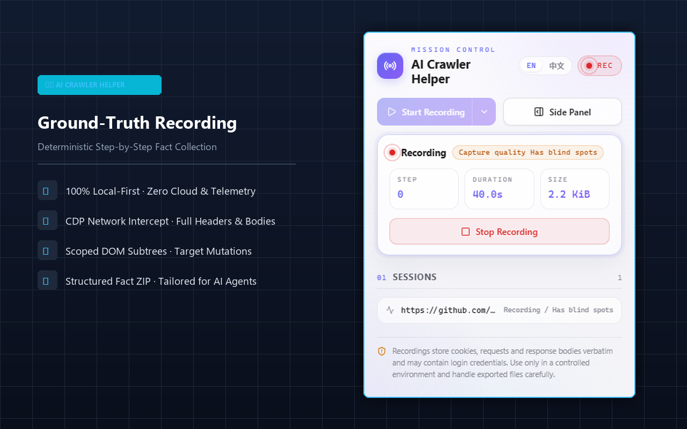
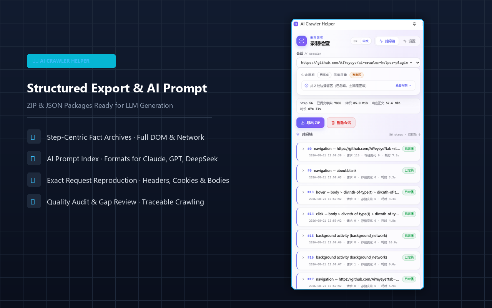
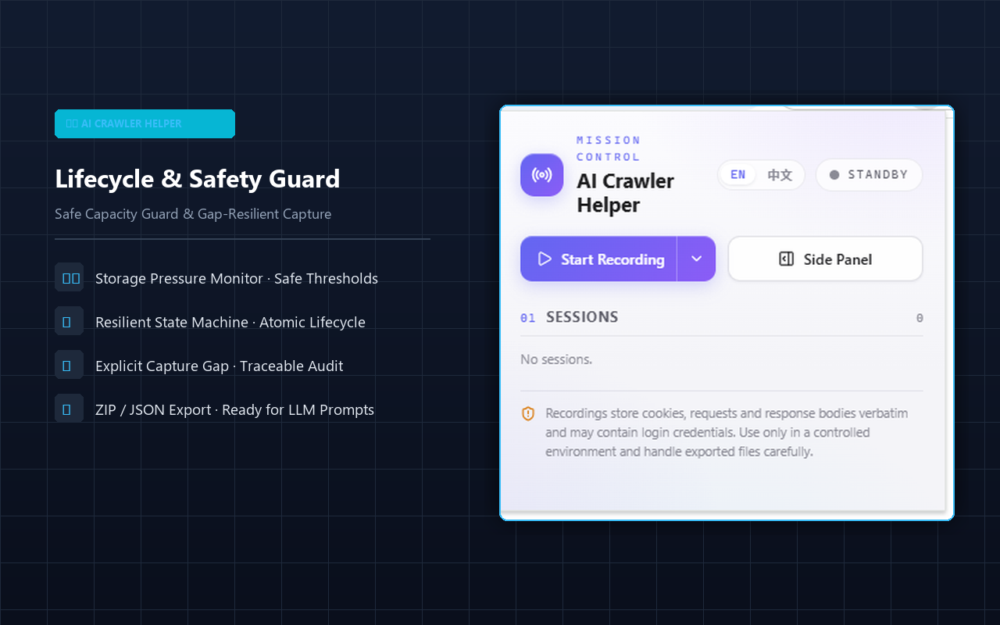
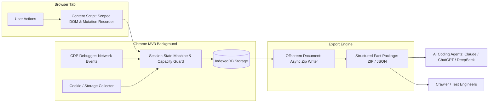

<div align="center">

# 🕷️ AI Crawler Helper

**A 100% local-first, Manifest V3 browser extension for deterministic web fact recording, DOM mutation tracking, and AI-ready crawler dataset export.**

[](https://github.com/AiYeyeye/ai-crawler-helper-plugin/actions/workflows/ci.yml)
[-blue.svg)](./LICENSE)
[](https://nodejs.org/)
[](https://pnpm.io/)
[](./CONTRIBUTING.md)
[](./PRIVACY.md)

[English](./README.md) | [简体中文](./README_zh.md)

</div>

---

## 📖 Overview

`AI Crawler Helper` is a developer-focused Chrome/Chromium Manifest V3 extension. When exploring target websites, it faithfully captures user interactions, scoped DOM subtrees, element mutations, navigation transitions, CDP-level network requests/responses, and storage state changes centered around discrete **Steps**, exporting them into versioned, structured fact packages.

Unlike fragile full-page HTML scrapers or opaque proxies, `AI Crawler Helper` records **ground-truth browser facts** designed to be consumed directly by AI agents (e.g., Claude, ChatGPT, DeepSeek) or human engineers to generate robust, production-grade Playwright, Puppeteer, or Scrapy crawlers.

---

## 📸 Screenshots

<div align="center">
  <table>
    <tr>
      <td align="center" width="33%">
        <b>Ground-Truth Fact Recording</b><br/><br/>
        
      </td>
      <td align="center" width="33%">
        <b>Structured Fact & AI Prompts</b><br/><br/>
        
      </td>
      <td align="center" width="33%">
        <b>Lifecycle & Safety Guard</b><br/><br/>
        
      </td>
    </tr>
  </table>
</div>

---

## ✨ Key Features

- 🔒 **100% Local-First & Zero Telemetry**: All data is stored in the browser's local IndexedDB. No backend servers, no cloud syncing, no telemetry, and no hidden tracking.
- 🎯 **Step-Centric Recording**: Groups interactions, scoped DOM changes, network traffic, and storage deltas into logical, sequential steps.
- 🌐 **CDP-Grade Network Capture**: Utilizes `chrome.debugger` (Chrome DevTools Protocol Network Domain) to faithfully record actual headers, status codes, query parameters, cookies, and response payloads.
- 🌳 **Minimal Scoped DOM Trees**: Captures only the target element's subtree, parent chains to `<body>`, and local mutations—preventing memory bloat and preserving high signal-to-noise ratio.
- 📦 **Structured Fact Packages**: One-click export to versioned ZIP archives (or single JSON for small sessions) with human- and LLM-readable markdown indexes.
- 🛡️ **Capacity & Quota Guard**: Real-time quota and memory monitoring automatically pauses recording before exceeding safe browser thresholds.

---

## 🏗️ Architecture & Data Flow



---

## 🚀 Quick Start

### Option 1: Install from Chrome Web Store (Recommended)
*(Coming Soon - Pending Chrome Web Store Review)*

### Option 2: Download Prebuilt Release (No Node.js / Build Tools Required)

If you just want to use the extension without setting up a developer environment:

1. **Download the latest release package**:
   - Go to [GitHub Releases](https://github.com/AiYeyeye/ai-crawler-helper-plugin/releases/latest).
   - Download the prebuilt archive: `ai-crawler-helper-plugin-v0.1.0.zip`.
2. **Unzip the package**:
   - Extract the `.zip` archive into a local folder on your computer (e.g., `Documents/ai-crawler-helper-plugin`).
3. **Load into Chrome / Edge**:
   1. Open Chrome and navigate to `chrome://extensions/` (or `edge://extensions/` in Edge).
   2. Enable **Developer mode** toggle in the top-right corner.
   3. Click **Load unpacked** in the top-left corner.
   4. Select the extracted folder containing `manifest.json`.
   5. Pin the extension to your toolbar and start recording immediately!

### Option 3: Build & Load from Source (For Developers)

#### Prerequisites
- [Node.js](https://nodejs.org/) (>= 20.x)
- [pnpm](https://pnpm.io/) (>= 9.x)
- Google Chrome or Chromium-based browser (>= 125)

#### Steps

1. **Clone the repository**:
   ```bash
   git clone https://github.com/AiYeyeye/ai-crawler-helper-plugin.git
   cd ai-crawler-helper-plugin
   ```

2. **Install dependencies**:
   ```bash
   pnpm install
   ```

3. **Build the extension**:
   ```bash
   pnpm run build
   ```

4. **Load the extension in Chrome**:
   1. Open Chrome and navigate to `chrome://extensions/`.
   2. Turn on **Developer mode** (top-right switch).
   3. Click **Load unpacked** (加载已解压的扩展程序).
   4. Select the `dist/` directory inside this repository.
   5. Open the Side Panel or click the extension icon to start recording!

---

## 💡 How to Use AI Crawler Helper (Step-by-Step Guide)

### 1. Open the Side Panel
Navigate to the target website you wish to crawl or test, click the extension icon on the Chrome toolbar, and select **"Open Side Panel"**. The companion interface will open alongside the page.

### 2. Start a Recording Session
- Click **"Start Recording"** (开始录制).
- Accept the host permission prompt if recording on this domain for the first time.
- A recording banner will indicate that CDP network capture and DOM observation are active.

### 3. Interact Naturally with the Web Page
Perform the user journey you want your crawler to automate:
- Click navigation links, buttons, or pagination controls.
- Fill out search forms or input login credentials.
- Scroll through dynamic feeds to trigger infinite scroll or lazy loading.

Each discrete interaction is automatically organized into a sequential **Step** containing:
- Target element selector, parent chain, and scoped DOM subtree.
- DOM mutations that occurred after the interaction.
- All HTTP/HTTPS requests, headers, and responses triggered by the action.
- Cookie and LocalStorage diffs.

### 4. Review Live Facts & Quality Audit
In the Side Panel:
- Inspect recorded steps, captured request counts, and execution duration in real time.
- Expand the **Capture Quality Audit** section to verify that no network blind spots occurred.

### 5. Stop Recording & Export Fact Package
- Click **"Stop Recording"** (停止录制).
- Select **"Export ZIP Fact Package"** (导出事实包).
- An archive named `export-session-[id].zip` will download directly to your local computer.

### 6. Feed into AI Agents to Generate Crawlers
Unpack the ZIP archive or provide `INDEX.md` and `session.json` to your favorite AI coding assistant (Claude, ChatGPT, DeepSeek, Cursor):

> **Example Prompt for AI**:
> *"Here is the structured browser interaction fact package recorded by AI Crawler Helper. Based on the recorded DOM locators, network request headers, and pagination steps in `INDEX.md`, please write a robust Python Playwright script that logs in, searches for items, and extracts the target dataset."*

---

## 📦 Exported Fact Package Structure

The exported ZIP archive contains deterministic, reproducible facts:

```text
export-session-[id].zip
├── session.json                  # Overall metadata, timeline, and capture gap audit
├── INDEX.md                      # AI and human readable step-by-step fact guide
├── steps/
│   ├── step-001/
│   │   ├── action.json           # Action type, target selector, coordinates, timestamp
│   │   ├── target-dom.html       # Scoped DOM subtree & parent chain
│   │   ├── mutations.json        # Observed DOM mutations during this step
│   │   ├── storage-diff.json     # Cookie/LocalStorage changes
│   │   └── requests/             # Network requests triggered by this step
│   │       ├── req-001-meta.json
│   │       └── req-001-body.bin
```

---

## 🛠️ Development & Testing

```bash
# Run unit tests
pnpm run test

# Run integration tests
pnpm run test:integration

# Type check
pnpm run typecheck

# Lint code
pnpm run lint
```

---

## ☕ Sponsorship & Support

If this project helps you build better crawlers or saves you development time, please consider supporting the project:

- ⚡ **Afdian (爱发电)**: [https://afdian.com/a/Crawler](https://afdian.com/a/Crawler)

Your support helps maintain the project, improve documentation, and keep it up to date with the latest browser APIs!

---

## ⚖️ License & Commercial Notice

This project is licensed under the **Apache License 2.0 with Non-Commercial Condition** - see the [LICENSE](./LICENSE) file for details.

- ✅ **Free for Personal, Academic, and Non-Commercial Use**.
- ❌ **Commercial Use Prohibited Without License**: Sublicensing, embedding in commercial SaaS/products, internal closed-source enterprise deployment, or resale requires an explicit commercial license.
- 💼 For enterprise licenses and commercial inquiries, please contact: `supercomputing@agent.qq.com`.
