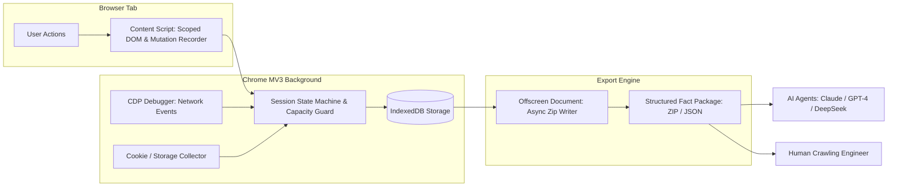

<div align="center">

# 🕷️ AI Crawler Helper

**A 100% local-first, Manifest V3 browser extension for deterministic web fact recording, DOM mutation tracking, and AI-ready crawler dataset export.**

[](https://github.com/AiYeyeye/ai-crawler-helper-plugin/actions/workflows/ci.yml)
[-blue.svg)](./LICENSE)
[](https://nodejs.org/)
[](https://pnpm.io/)
[](./CONTRIBUTING.md)
[](./PRIVACY.md)

[English](./README.md) | [中文说明](#-中文说明)

</div>

---

## 📖 Overview

`AI Crawler Helper` is a developer-focused Chrome/Chromium Manifest V3 extension. When exploring target websites, it faithfully captures user interactions, scoped DOM subtrees, element mutations, navigation transitions, CDP-level network requests/responses, and storage state changes centered around discrete **Steps**, exporting them into versioned, structured fact packages.

Unlike fragile full-page HTML scrapers or opaque proxies, `AI Crawler Helper` records **ground-truth browser facts** designed to be consumed directly by AI agents (e.g., Claude, GPT-4, DeepSeek) or human engineers to generate robust, production-grade Playwright, Puppeteer, or Scrapy crawlers.

---

## ✨ Key Features

- 🔒 **100% Local-First & Zero Telemetry**: All data is stored in the browser's local IndexedDB. No backend servers, no cloud syncing, no telemetry, and no hidden tracking.
- 🎯 **Step-Centric Recording**: Groups interactions, scoped DOM changes, network traffic, and storage deltas into logical, sequential steps.
- 🌐 **CDP-Grade Network Capture**: Utilizes `chrome.debugger` (Chrome DevTools Protocol Network Domain) to faithfully record actual headers, status codes, query parameters, and response payloads.
- 🌳 **Minimal Scoped DOM Trees**: Captures only the target element's subtree, parent chains to `<body>`, and local mutations—preventing memory bloat and preserving high signal-to-noise ratio.
- 📦 **Structured Fact Packages**: One-click export to versioned ZIP archives (or single JSON for small sessions) with human- and LLM-readable markdown indexes.
- 🛡️ **Capacity & Quota Guard**: Real-time quota and memory monitoring automatically pauses recording before exceeding safe browser thresholds.

---

## 🏗️ Architecture & Data Flow



---

## 🚀 Quick Start

### Option 1: Install from Chrome Web Store (Recommended)
*(Coming Soon - Pending Chrome Web Store Review)*

### Option 2: Build & Load from Source

#### Prerequisites
- [Node.js](https://nodejs.org/) (>= 20.x)
- [pnpm](https://pnpm.io/) (>= 9.x)
- Google Chrome or Chromium-based browser (>= 125)

#### Steps

1. **Clone the repository**:
   ```bash
   git clone https://github.com/AiYeyeye/ai-crawler-helper-plugin.git
   cd ai-crawler-helper-plugin
   ```

2. **Install dependencies**:
   ```bash
   pnpm install
   ```

3. **Build the extension**:
   ```bash
   pnpm run build
   ```

4. **Load the extension in Chrome**:
   1. Open Chrome and navigate to `chrome://extensions/`.
   2. Turn on **Developer mode** (top-right switch).
   3. Click **Load unpacked** (加载已解压的扩展程序).
   4. Select the `dist/` directory inside this repository.
   5. Open the Side Panel or click the extension icon to start recording!

---

## 🛠️ Development & Testing

```bash
# Run unit tests
pnpm run test

# Run integration tests
pnpm run test:integration

# Type check
pnpm run typecheck

# Lint code
pnpm run lint
```

---

## 📦 Exported Fact Package Structure

The exported ZIP archive contains deterministic, reproducible facts:

```text
export-session-[id].zip
├── session.json                  # Overall metadata, timeline, and capture gap audit
├── INDEX.md                      # AI and human readable step-by-step fact guide
├── steps/
│   ├── step-001/
│   │   ├── action.json           # Action type, target selector, coordinates, timestamp
│   │   ├── target-dom.html       # Scoped DOM subtree & parent chain
│   │   ├── mutations.json        # Observed DOM mutations during this step
│   │   ├── storage-diff.json     # Cookie/LocalStorage changes
│   │   └── requests/             # Network requests triggered by this step
│   │       ├── req-001-meta.json
│   │       └── req-001-body.bin
```

---

## ☕ Sponsorship & Support (赞助与支持)

If this project helps you build better crawlers or saves you development time, please consider supporting the project:

- 💖 [GitHub Sponsors](https://github.com/sponsors/AiYeyeye)
- ☕ [Buy Me a Coffee](https://www.buymeacoffee.com/your-id)
- ⚡ [爱发电 (Afdian)](https://afdian.com/@your-id)

Your support helps maintain the project, improve documentation, and keep it up to date with the latest browser APIs!

---

## ⚖️ License & Commercial Notice

This project is licensed under the **Apache License 2.0 with Non-Commercial Condition** - see the [LICENSE](./LICENSE) file for details.

- ✅ **Free for Personal, Academic, and Non-Commercial Use**.
- ❌ **Commercial Use Prohibited Without License**: Sublicensing, embedding in commercial SaaS/products, internal closed-source enterprise deployment, or resale requires an explicit commercial license.
- 💼 For enterprise licenses and commercial inquiries, please contact: `[your-email@domain.com]`.

---

<br/>

## 🇨🇳 中文说明

### 项目简介
`AI Crawler Helper` 是一款基于 Chrome/Chromium Manifest V3 的**完全本地化**浏览器录制扩展。当你在真实目标站点中手动操作时，插件以 **Step（步骤）** 为核心单位，忠实记录用户操作、局部目标 DOM 树、DOM 变化、URL 导航、CDP 级网络请求/响应以及 Cookie/Storage 状态变化，并导出一键可供 AI 分析的结构化事实数据包。

### 核心亮点
1. **100% 纯本地运行**：零云端依赖、无后端、无遥测上报，数据仅保存在浏览器本地 IndexedDB 中。
2. **CDP 深度抓包**：借助 Chrome Debugger 协议采集最真实的请求头、状态码与响应体。
3. **精准局部 DOM**：仅保留目标元素完整子树与父链，避免整页快照的冗余噪音。
4. **AI 友好数据结构**：导出的 ZIP 包自带结构化索引与 Markdown 指引，可直接喂给 Claude / GPT-4 / DeepSeek 自动生成 Playwright / Puppeteer / Scrapy 爬虫。
5. **容量安全水位保护**：实时监测存储配额，超限自动暂停，防止浏览器崩溃。

### 赞助与打赏
如果你觉得这个工具有效提升了你的爬虫开发效率，欢迎通过以下方式赞助作者：
- **爱发电**：[https://afdian.com/@your-id](https://afdian.com/@your-id)
- **微信 / 支付宝**：*(可在 GitHub Release / Wiki 中提供赞赏码)*
- **GitHub Sponsors**：[https://github.com/sponsors/AiYeyeye](https://github.com/sponsors/AiYeyeye)

### 开源与商用说明
本项目遵循 **Apache-2.0 附带非商业化限制条款（Non-Commercial）**。个人学习、研究与非商用场景完全免费；任何企业内部闭源集成、SaaS 化打包或商业化销售行为，均需联系作者获取商业授权。
