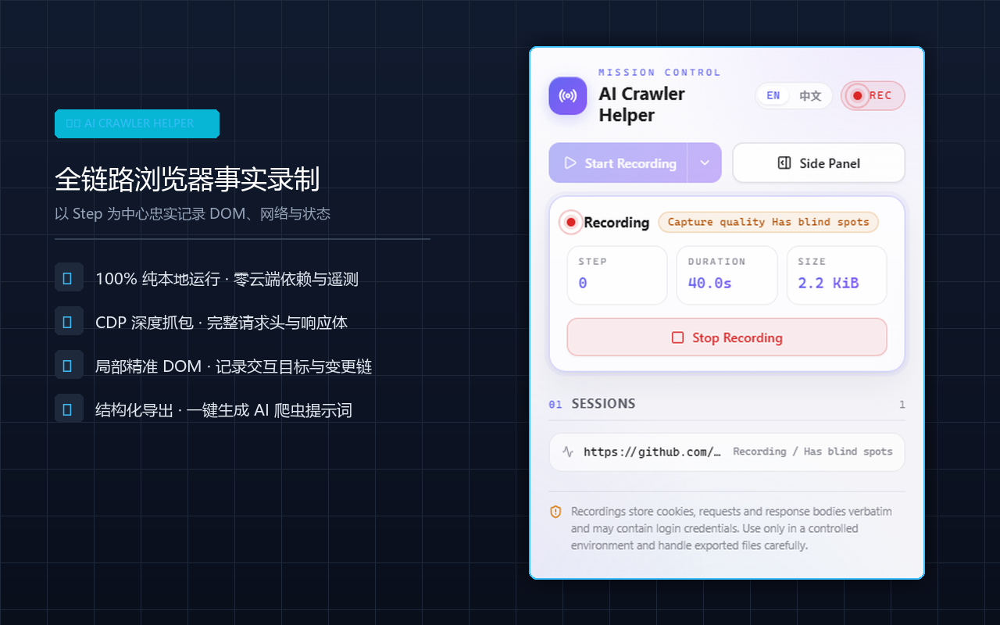
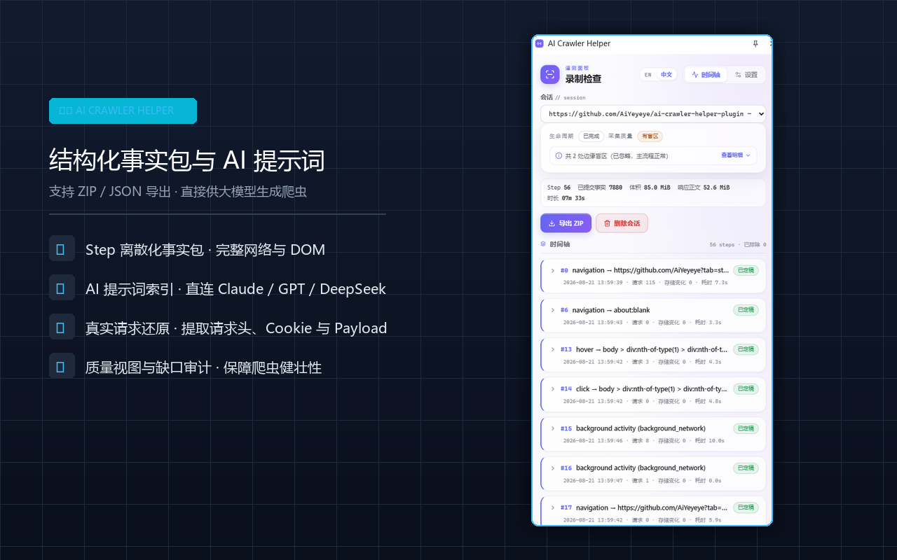
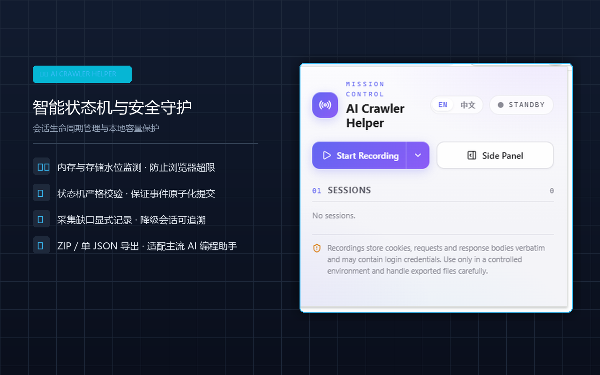
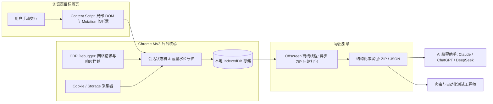

<div align="center">

# 🕷️ AI Crawler Helper (爬虫辅助录制扩展)

**100% 纯本地运行的 Chrome Manifest V3 扩展：精准记录网页交互、局部 DOM 树变更、CDP 深度抓包与状态差异，一键导出供 AI 生成健壮爬虫。**

[](https://github.com/AiYeyeye/ai-crawler-helper-plugin/actions/workflows/ci.yml)
[-blue.svg)](./LICENSE)
[](https://nodejs.org/)
[](https://pnpm.io/)
[](./CONTRIBUTING.md)
[](./PRIVACY.md)

[English](./README.md) | [简体中文](./README_zh.md)

</div>

---

## 📖 项目简介

`AI Crawler Helper` 是一款专为爬虫开发工程师与自动化测试人员打造的 Chrome / Chromium Manifest V3 浏览器扩展。

当你在目标站点中手动操作时，扩展以 **Step（步骤）** 为核心单位，忠实记录用户操作、目标元素局部 DOM 子树、DOM 动态突变（Mutation）、URL 导航、CDP 级完整网络请求/响应体以及 Cookie/Storage 状态变化，并一键导出版权化、结构化的事实数据包（Fact Package）。

不同于脆弱的整页 HTML 抓取工具或沉重的黑盒代理，`AI Crawler Helper` 只采集**客观真实的浏览器事实**，导出的数据可直接投喂给大语言模型（Claude、ChatGPT、DeepSeek 等）或工程师，一键生成高可用、抗反爬的 Python (Playwright / DrissionPage / Scrapy) 或 Node.js (Puppeteer) 爬虫代码。

---

## 📸 功能与界面预览

<div align="center">
  <table>
    <tr>
      <td align="center" width="33%">
        <b>全链路事实录制面板</b><br/><br/>
        
      </td>
      <td align="center" width="33%">
        <b>结构化事实包与 AI 提示词</b><br/><br/>
        
      </td>
      <td align="center" width="33%">
        <b>智能状态机与安全守护</b><br/><br/>
        
      </td>
    </tr>
  </table>
</div>

---

## ✨ 核心亮点

- 🔒 **100% 纯本地运行 · 零遥测上报**：所有数据均持久化在浏览器本地 IndexedDB 中。无后端云服务器、无数据上传、无追踪遥测。
- 🎯 **以 Step 为核心的离散化录制**：将用户的每一次点击、输入、滚动与因其触发的网络请求、局部 DOM 变化紧密关联为离散步骤。
- 🌐 **CDP 深度抓包（DevTools 协议）**：通过 `chrome.debugger` 真实记录所有请求头、响应头、状态码、Cookie 与响应正文（包含 JSON / 文本 / 二进制元数据）。
- 🌳 **精准局部 DOM 树提取**：仅保存操作目标元素的完整子树、到 `<body>` 的父链和局部突变，杜绝整页 HTML 带来的噪音与内存膨胀。
- 📦 **专为大模型设计的结构化事实包**：一键导出版本化 ZIP 归档包（或小会话单 JSON），内置 `INDEX.md`，可直接复制为 AI 编程 Prompt。
- 🛡️ **容量水位与安全守护机制**：实时监控本地存储与内存压力，超限前自动安全暂停，绝不静默丢弃数据或导致浏览器崩溃。

---

## 🏗️ 架构设计与数据流



---

## 🚀 快速上手

### 方式 1：从 Chrome Web Store 安装（推荐）
*(即将上线 - 正在 Chrome 应用商店审核中)*

### 方式 2：本地源码构建与加载

#### 环境要求
- [Node.js](https://nodejs.org/) (>= 20.x)
- [pnpm](https://pnpm.io/) (>= 9.x)
- Google Chrome 或 Chromium 内核浏览器 (>= 125)

#### 构建步骤

1. **克隆本仓库**：
   ```bash
   git clone https://github.com/AiYeyeye/ai-crawler-helper-plugin.git
   cd ai-crawler-helper-plugin
   ```

2. **安装依赖**：
   ```bash
   pnpm install
   ```

3. **执行编译打包**：
   ```bash
   pnpm run build
   ```

4. **在 Chrome 浏览器中加载插件**：
   1. 打开 Chrome 并在地址栏输入 `chrome://extensions/`。
   2. 打开右上角的 **「开发者模式」** 开关。
   3. 点击左上角的 **「加载已解压的扩展程序」**。
   4. 选择本项目中的 `dist/` 目录。
   5. 打开浏览器侧边栏即可开始录制！

---

## 💡 插件详细使用指南（Step-by-Step）

### 第一步：打开目标网页并唤起侧边栏
1. 在 Chrome 中打开你要爬取或测试的目标网站（例如登录页、搜索列表页、商品详情页等）。
2. 点击 Chrome 工具栏上的 `AI Crawler Helper` 插件图标，点击 **「打开侧边栏 (Open Side Panel)」**，插件将作为辅助面板并排显示在网页右侧。

### 第二步：启动录制会话
1. 在侧边栏或 Popup 弹窗中点击 **「开始录制」** 按钮。
2. 浏览器顶部会弹出提示条，表明 Chrome 调试器（CDP）已就绪并开始监听网络和 DOM。

### 第三步：在目标网页中正常手动操作
按照你想要自动化的业务流程，在网页上正常操作：
- **点击交互**：点击登录按钮、分类标签、展开详情或点击下一页翻页。
- **表单输入**：在搜索框输入关键词，或在表单输入用户名/密码。
- **动态滚动**：向下滚动页面触发瀑布流懒加载或无限加载。

插件会自动将每一次操作归纳为一个独立的 **Step（步骤）**，并自动关联记录：
- 目标元素的定位选择器、父链路径及局部 DOM 树。
- 点击后页面发生的 DOM 变化（Mutations）。
- 该操作触发的所有 HTTP/HTTPS API 接口、请求头、Cookie 及返回的 JSON 数据。

### 第四步：实时事实与盲区审查
在侧边栏中你可以随时：
- 实时查看当前已录制的步骤数量、请求总数与操作耗时。
- 展开查看特定步骤的详细网络请求与状态码。
- 展开 **「采集质量审计」** 折叠栏，确认是否存在 iframe 分离或跨域盲区。

### 第五步：停止录制并导出事实包
1. 操作完成后，点击 **「停止录制」**。
2. 确认无误后点击 **「导出事实包 (ZIP)」**。
3. 浏览器将自动下载一个名为 `export-session-[id].zip` 的结构化归档文件至你的电脑。

### 第六步：投喂大模型，一键生成爬虫代码
解压导出的 ZIP 包，将其中的 `INDEX.md` 和关键 JSON 文件直接发送给你常用的大模型编程助手（如 Claude、ChatGPT、DeepSeek、Cursor 等）：

> 💬 **向 AI 提问的推荐 Prompt 模板**：
> ```text
> 我使用 AI Crawler Helper 录制了目标站点的真实浏览器交互事实。
> 请阅读附件中 INDEX.md 里的步骤时序、请求头以及 DOM 选择器：
> 1. 请帮我用 Python (Playwright / Requests) 编写一段健壮的爬虫脚本，完整复现上述步骤中的登录、搜索及翻页数据抓取。
> 2. 请提取第 2 步和第 3 步中核心 API 请求的 Query 参数和 Headers（保留必要的 Cookie 与 Token 构造逻辑）。
> 3. 针对响应的 JSON 数据结构，编写字段提取与异常重试逻辑。
> ```

---

## 📦 导出事实包目录结构

导出的 ZIP 文件包含完整、可追溯的结构化数据：

```text
export-session-[id].zip
├── session.json                  # 会话全局元数据、时间轴与质量缺口审计
├── INDEX.md                      # AI 和工程师可直接阅读的分步事实索引
├── steps/
│   ├── step-001/
│   │   ├── action.json           # 操作类型、选择器、坐标、时间戳
│   │   ├── target-dom.html       # 目标元素局部 DOM 子树与父链
│   │   ├── mutations.json        # 该步骤期间发生的 DOM 突变
│   │   ├── storage-diff.json     # Cookie 与 LocalStorage 变化增量
│   │   └── requests/             # 该操作触发的网络请求列表
│   │       ├── req-001-meta.json
│   │       └── req-001-body.bin
```

---

## 🛠️ 本地开发与测试

```bash
# 运行单元测试
pnpm run test

# 运行集成测试
pnpm run test:integration

# TypeScript 类型检查
pnpm run typecheck

# 代码规范检查 (ESLint)
pnpm run lint
```

---

## ☕ 赞助与支持

如果你觉得这个工具提升了你的爬虫开发效率或为你节省了时间，欢迎通过以下方式支持作者持续维护：

- ⚡ **爱发电主页**：[https://afdian.com/a/Crawler](https://afdian.com/a/Crawler)
- 📱 **微信 / 支付宝扫码赞助**：

<div align="center">
  <table>
    <tr>
      <td align="center" width="260">
        <b>微信支付 (WeChat Pay)</b><br/><br/>
        
      </td>
      <td align="center" width="260">
        <b>支付宝 (Alipay)</b><br/><br/>
        
      </td>
    </tr>
  </table>
</div>

感谢你的每一份支持，这能帮助我们持续适配最新的 Chrome API 并完善功能！

---

## ⚖️ 开源协议与商业授权声明

本项目基于 **Apache License 2.0 附带非商业化限制条款（Non-Commercial）** 开源 - 详见 [LICENSE](./LICENSE) 文件。

- ✅ **个人学习、学术研究与非商业用途完全免费**。
- ❌ **严禁未经授权的商业化使用**：任何分发、转售、集成进企业商业闭源产品/SaaS 平台或用于营利性服务，均须联系作者获取正式的商业授权。
- 💼 **企业商业授权与商务咨询邮箱**：`supercomputing@agent.qq.com`。
