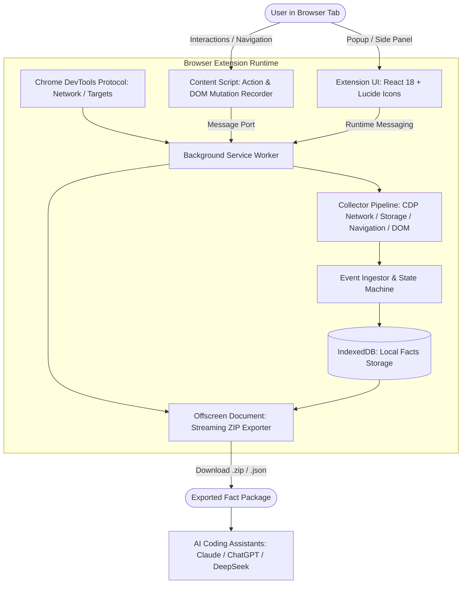

# 🏗️ Architecture Overview

**AI Crawler Helper** is a local-only Chrome extension (Manifest V3) designed to record ground-truth browser interaction facts for AI-driven crawler code generation. It operates completely on the client side with zero external network requests and zero backend telemetry.

---

## 🧩 High-Level Architecture

---

## 📦 Core Subsystems

### 1. 🌐 Background Service Worker (`src/background/`)
- **Lifecycle Coordinator**: Manages session state machine (`idle` → `starting` → `recording` → `stopping` → `completed`).
- **CDP Debugger Manager**: Manages `chrome.debugger` attachment, child iframe targets (`Target.setAutoAttach`), and network stream capturing (`Network.*` events).
- **Self-Healing Stop Finalization**: Handles adaptive late-response draining with fallback recovery, ensuring sessions always finalize safely.

### 2. ⚡ Content Scripts (`src/content/`)
- **Zero Floating DOM**: Injected scripts produce no visible overlay or DOM pollution, preserving byte-for-byte target page fidelity.
- **Action Recorder**: Captures user clicks, keystrokes, form submissions, and scrolls with precise CSS selectors and XPath.
- **DOM Mutation Recorder**: Uses `MutationObserver` with strict batching and budget capping to record sub-tree mutations without lagging the browser.

### 3. 💾 Storage & Persistence Layer (`src/persistence/`)
- **Local IndexedDB**: 16 dedicated object stores partitioning sessions, steps, navigations, requests, response bodies, storage diffs, and capture gaps.
- **Atomic Writes**: Uses single-transaction atomic commits to ensure zero partial writes or corrupted states.

### 4. 🗜️ Offline Exporter (`src/offscreen/`)
- **Offscreen Document**: Uses streaming `fflate` compression to assemble ZIP packages containing structured JSON and raw binary responses without blocking the main browser thread.
- **AI Prompt Generator**: Generates `INDEX.md` and structured schema summaries optimized for consumption by Claude, ChatGPT, DeepSeek, and Cursor.

---

## 🔒 Security & Privacy

- **100% Client-Side**: No telemetry, analytics, or remote API calls.
- **Safe Sanitization**: Redacts sensitive headers (e.g. `Authorization`, bearer tokens) based on user-configured masking rules.
